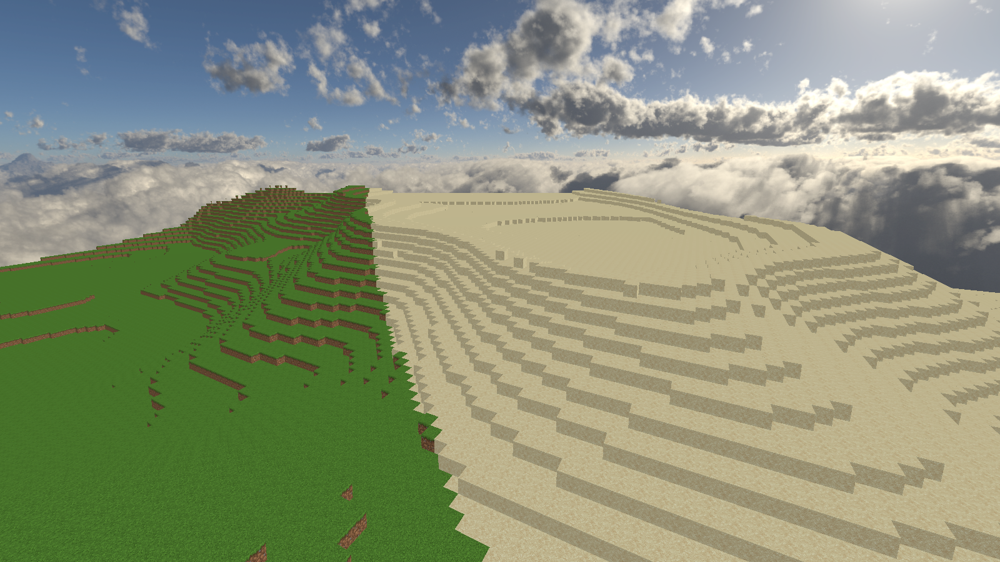
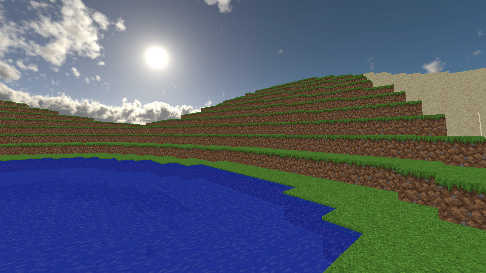
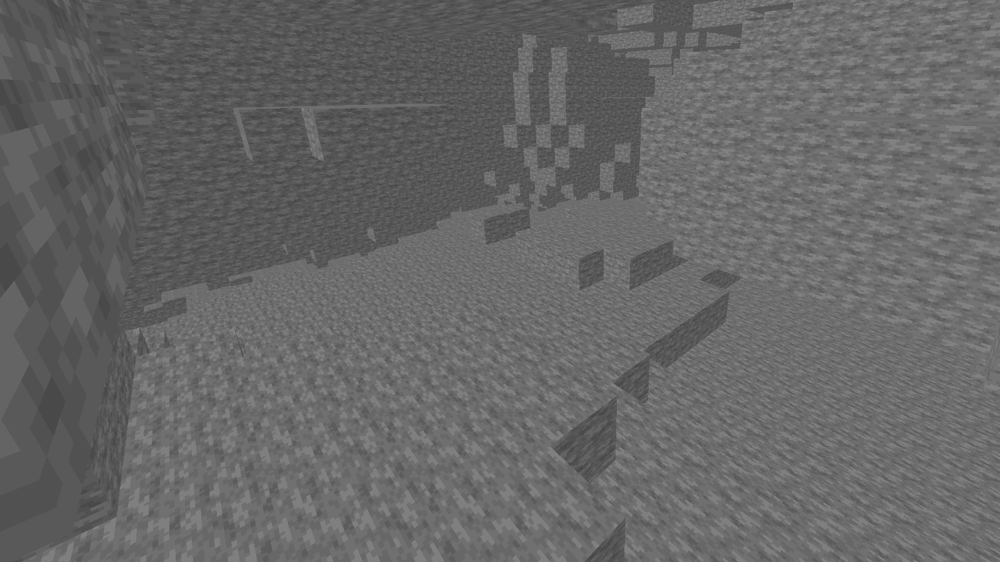

# ft_vox
### Overview

ft_vox is a C++ and OpenGL project that serves as an introduction to voxel engines, inspired by the iconic game Minecraft. The primary goal of this project was to create a vast, procedurally generated world made up of voxels, which the user can explore. This README provides a comprehensive overview of the project, its objectives, features, and instructions for running the application.

<p align="center">
  
  
  
</p>

### Features

   - **Procedural World Generation :** The project generates a very vast procedural world, ensuring a unique terrain with each new seed. The terrain includes hills, mountains, caves, and water.
   - **Biomes :** The world includes three distinct biomes. Plains, mountains, and deserts. Each with its unique terrain characteristics.
   - **Voxel Types and Textures :** The world consists of different types of textured cubes, including grass, dirt, sand, snow, and stone. Transparent water voxels have been added for realism.
   - **Smooth Rendering :** The rendering engine is highly optimized to ensure smooth fps, without freezing visuals even when rapidly traversing the world at high speeds.
   - **Shadows :** Subtle shadow effects have been implemented to enhance the visual depth and realism of the world.
   - **Camera Controls :** A first-person camera allows for intuitive navigation through the world. The camera can be controlled with the mouse (or ```🠔🠕🠗🠖``` ) and keyboard (```WASD```), with the option to increase the movement speed by 20x (```shift```).
   - **Skybox :** A seamless skybox surrounds the world, ensuring an immersive experience with no visual artifacts.

### Project Objectives

The primary objectives of the ft_vox project were to :

	- Develop a voxel-based graphics engine capable of rendering a large, procedurally generated world.
 	- Optimize the rendering to handle vast numbers of cubes efficiently, ensuring smooth gameplay.
  	- Implement different types of cubes and textures, including transparent and opaque types.
	- Create a natural-looking world using advanced procedural generation techniques.
 	- Design an intuitive and responsive camera system for exploration.
  	- Provide a visually appealing environment with effects such as a skybox and shadows.

### Technical Details

   - **Language :** ```C++```
   - **Graphics API :** ```OpenGL```
   - **Libraries :** ```GLM``` for the vector and matrixes calculations and ```stb_image``` to load textures.
   - **Memory Management :** ```RAM``` and ```VRAM``` management to prevent memory leaks or excessive usage, allowing the program to run for extended periods without degradation in performance.

### Running the Project

#### Prerequisites	

Before running the project, ensure you have the following :
   - A ```C++``` compiler.
   - ```OpenGL 4.3``` or higher.
   - ```GLFW``` for input and window managegment.
   - ```GLM``` for handling math operations.

#### Installation

   - 1 . Clone the repository :

	git clone https://github.com/awe-fr/ft_vox.git

   - 2 . Build the project :

	cd ft_vox
 	make

   - 3 . Run the executable :

	./ft_vox
 	or
  	./ft_vox [seed]

#### Controls

   - **WASD :** Move forward, backward, left, and right.
   - **CTL / SPACE :** Move upward, downward.
   - **Mouse :** Control the camera.
   - **Shift :** Increase movement speed by 20x.
   - **Esc :** Exit the program
